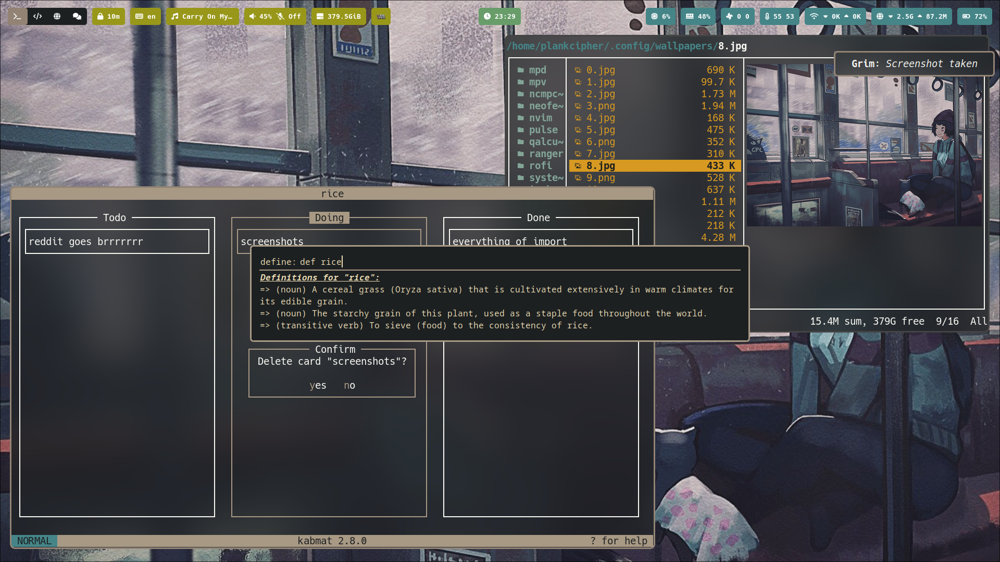
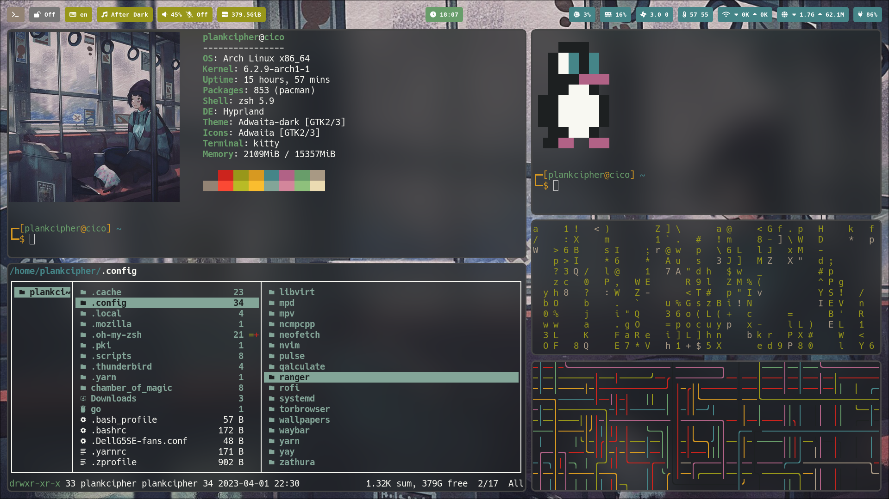

  <h1>Dots</h1>

  

 

## Stuff inside

- WM: [`hyprland`](https://github.com/hyprwm/hyprland)
- Screen lock: [`swaylock-effects`](https://github.com/mortie/swaylock-effects)
- Application launcher: [`lbonn's rofi fork`](https://github.com/lbonn/rofi)
- Terminal: [`kitty`](https://github.com/kovidgoyal/kitty)
- Shell: [`zsh`](https://www.zsh.org/) with [`Oh My Zsh`](https://ohmyz.sh/)
- Image viewer: [`imv`](https://sr.ht/~exec64/imv/)
- Video player: [`mpv`](https://mpv.io/)
- Music player: [`mpd`](https://wiki.archlinux.org/index.php/Music_Player_Daemon) and [`ncmpcpp`](https://wiki.archlinux.org/index.php/Ncmpcpp)
- Notifications: [`dunst`](https://wiki.archlinux.org/index.php/Dunst) and [`libnotify`](https://wiki.archlinux.org/index.php/Desktop_notifications#Libnotify)

## Installation

### Arch Linux

On a fresh Arch install, clone this repo and run `spice_it_up.sh'.

> **Note**: Please read the script first.

### Non Arch

You can use the dotfiles, but not the installation script because it is made only for Arch, specially the dependencies part of it. I guess you can do the dependencies part on your own and reference the script for next steps.
